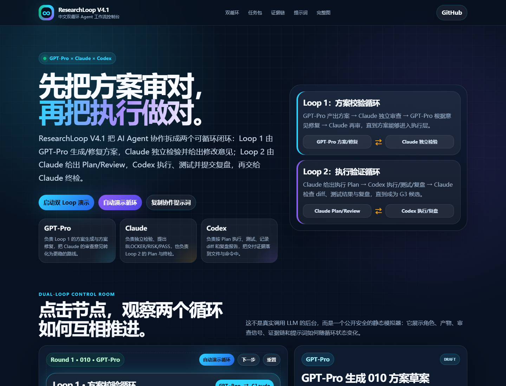

# ResearchLoop V4.1 · 中文双循环 Agent 工作流控制台

[Live Demo](https://124-creator.github.io/ResearchLoop/) · [V4 Protocol](./docs/v4/000-dual-loop-controller-v4.md) · [Plan Template](./templates/v4-plan-template.md) · [MIT License](./LICENSE)

ResearchLoop V4.1 是一个面向 AI Agent 协作的双循环工作流 Demo。它展示的不是单个 Prompt，而是一套多智能体协作机制：先由 **GPT-Pro × Claude** 完成方案校验循环，再由 **Claude × Codex** 完成执行验证循环。

## Preview

## Live Demo

打开： https://124-creator.github.io/ResearchLoop/

这个页面是静态公开 Demo：不上传文本，不调用外部 API，不包含私有数据。所有交互都在浏览器本地完成。

## 双循环机制

### Loop 1 · 方案校验循环

~~~text
GPT-Pro 生成方案
↓
Claude 独立检验：BLOCKER / RISK / PASS
↓
GPT-Pro 根据修改意见修复方案
↓
Claude 再次检验
↓
通过后进入执行层
~~~

Loop 1 解决的问题是：**先判断怎么做才是对的。**

核心产物：010 问题定义、012 风险地图、015 证据基线、020 候选路线、030 Claude 审查意见、035 修复路线、040 Test Oracle。

### Loop 2 · 执行验证循环

~~~text
Claude 给出执行 Plan
↓
Codex 按 Plan 执行、测试、记录证据
↓
Codex 写复盘报告
↓
Claude 检查 diff、测试结果与复盘
↓
通过后进入 G3 候选
~~~

Loop 2 解决的问题是：**把已经确认正确的方案真正做对。**

核心产物：Claude execution plan、Codex implementation、test result、diff evidence、Codex retrospective、Claude final review、G3 candidate。

## Interactive Demo includes

- 中文双循环控制台：直观看到 GPT-Pro、Claude、Codex 的职责分工。
- 点击节点联动：详情面板、审查信号、证据链、提示词同步变化。
- 自动演示循环：从 Loop 1 到 Loop 2，再进入下一轮。
- 下一步推进：手动观察每个节点的状态转换。
- 010 Packet Lab：把一句话任务转换为 Loop 1 输入。
- 完整 V4 流程图：保留全局协议地图，方便面试讲解。

## Quick Start

1. 打开 Live Demo。
2. 点击「自动演示循环」，观察两个 Loop 如何推进。
3. 点击任意节点，例如 Claude 独立检验 或 Codex 执行，查看联动证据与提示词。
4. 在 010 Packet Lab 输入一个任务，生成 Loop 1 输入包。
5. 阅读协议文档：./docs/v4/000-dual-loop-controller-v4.md

## Why it matters

普通 Agent 工作容易失败在四个地方：目标不稳定、风险未显式化、执行无证据、审查不独立。ResearchLoop V4.1 用两个循环把这些问题拆开：

| 问题 | ResearchLoop V4.1 的处理方式 |
| --- | --- |
| 方案没审清就开始做 | Loop 1 先由 Claude 独立检验 GPT-Pro 的方案 |
| 修改意见没有闭环 | GPT-Pro 必须根据 Claude 的 BLOCKER/RISK 修复 |
| 执行时偏离计划 | Loop 2 中 Codex 只能按 Claude Plan 执行 |
| 做完无法复核 | Codex 输出复盘，Claude 检查 diff、测试与证据 |

## Repository map

~~~text
ResearchLoop/
├─ apps/                      中文双循环动态 Demo
├─ assets/                    流程图和预览图
├─ docs/v4/                   V4 协议源文件
├─ examples/                  示例工作流产物
├─ templates/                 Plan 和复盘模板
├─ AGENTS.md                  Codex 执行契约
├─ DESIGN.md                  Demo 设计源事实
└─ README.md                  仓库首页
~~~

## Privacy Boundary

公开仓库不应包含私有数据、凭据、个人联系方式、本地绝对路径或未公开项目材料。本 Demo 只用于展示工作流机制，不是后端执行服务。

## Status

- Current focus: V4.1 中文双循环动态控制台。
- Deployment target: GitHub Pages。
- Verification style: local browser check, old-term scan, sensitive-info scan, live page HTTP check, and screenshot preview.

## License

MIT License.
