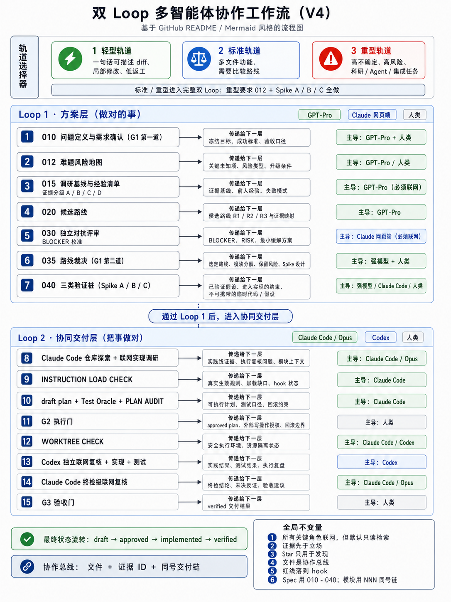

# ResearchLoop V4 · Multi-Agent Research Workflow

> **双 Loop 多智能体科研 / 工程协作工作流**：把模糊目标冻结成结构化 Spec，再通过证据分级、路线裁决、Test Oracle、Worktree Check、过程复盘和终检，把 Claude / Codex / GPT-Pro 等 Agent 的协作变成可审计、可回滚、可验收的交付链。
>
> A dual-loop multi-agent workflow for research and engineering: freeze ambiguous goals into structured specs, then deliver through evidence grading, route arbitration, test oracles, worktree checks, retrospectives, and independent review.



## Why ResearchLoop

单独使用 AI 编程工具时，常见问题不是“不会生成代码”，而是：

- **目标模糊**：成功标准、硬约束和不做什么没有冻结。
- **路线漂移**：Agent 很容易在执行中暗改方向或范围。
- **证据混杂**：官方文档、GitHub Star、论坛经验和个人猜测被混成同一可信度。
- **验收困难**：没有 Test Oracle，最后只能靠“看起来差不多”。
- **协作断层**：规划、执行、复盘、审查之间没有统一文件总线。

ResearchLoop V4 的目标是：**先做对的事，再把事做对。**

## Core architecture

```text
Loop 1 · 方案层（做对的事）
010 问题定义 / FROZEN
-> 012 难题风险地图
-> 015 调研基线与证据分级 A/B/C/D
-> 020 候选路线
-> 030 独立对抗评审
-> 035 路线裁决
-> 040 Spike A/B/C 验证

Loop 2 · 协同交付层（把事做对）
调研台账
-> plan + Test Oracle + PLAN AUDIT
-> G2 approved
-> INSTRUCTION LOAD CHECK
-> WORKTREE CHECK
-> Codex 执行 + 测试 + 过程复盘
-> Claude Code 终检 + 反证搜索
-> G3 verified
```

## Human gates

| Gate | Meaning | Checks |
|---|---|---|
| **G1 · 方向门** | 做对的事、走对的路 | 问题定义、成功标准、路线裁决、BLOCKER 处置 |
| **G2 · 执行门** | 这份计划能否安全执行 | PLAN AUDIT、Test Oracle、产物清单、隔离、回滚、外部写权限 |
| **G3 · 验收门** | 交付是否真的正确 | 新鲜测试证据、终检、反证搜索、规格符合性 |

状态流：

```text
draft -> approved -> implemented -> verified
```

## Repository map

```text
.
├── AGENTS.md                                  # Codex / executor contract
├── CLAUDE.md                                  # Claude Code / reviewer contract
├── apps/
│   └── researchloop.html                      # ResearchLoop HTML prototype
├── assets/
│   └── researchloop-v4-flowchart.png          # V4 workflow diagram
├── docs/
│   ├── architecture.md                        # Architecture notes
│   ├── v4/
│   │   ├── README.md
│   │   ├── 000-dual-loop-controller-v4.md
│   │   ├── 010-claude-code-reviewer-v4.md
│   │   └── 020-codex-executor-v4.md
│   └── retrospectives/
├── examples/
│   ├── 010-problem-definition-example.md
│   ├── example-plan.md
│   └── example-retrospective.md
└── templates/
    ├── plan-template.md
    ├── retrospective-template.md
    ├── v4-plan-template.md
    └── v4-retrospective-block-template.md
```

## Quick start

1. Start with the [ResearchLoop HTML prototype](./apps/researchloop.html), or copy [`examples/010-problem-definition-example.md`](./examples/010-problem-definition-example.md).
2. Freeze the task as `010-问题定义.md` before implementation.
3. For complex tasks, follow [`docs/v4/000-dual-loop-controller-v4.md`](./docs/v4/000-dual-loop-controller-v4.md).
4. Let the reviewer prepare a plan with [`templates/v4-plan-template.md`](./templates/v4-plan-template.md).
5. Let the executor implement only after G2 approved, then append retrospective blocks with [`templates/v4-retrospective-block-template.md`](./templates/v4-retrospective-block-template.md).
6. Do not mark work `verified` until independent review and G3 acceptance.

## Battle-tested use cases

This workflow has been used across competition and research projects:

| Project type | Scale | Workflow evidence |
|---|---:|---|
| Mathematical modeling competition | 74 hours, 4 modeling questions + paper | 20+ retrospectives, formula checks, external review |
| Carbon price forecasting research | 19 staged experiments | train/dev/test protocol, leakage audit, model comparison |
| Machine-learning decision platform | 12-step data-to-platform pipeline | step retrospectives, SHAP review, platform refactor |

## License

[MIT](./LICENSE) © 2026 田中斐 (Tian Zhongfei)


