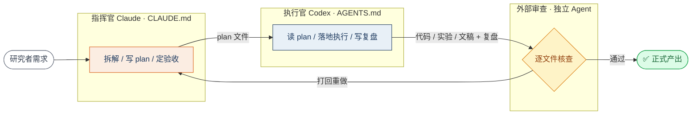

# 多 Agent 科研协作工作流 · Multi-Agent Research Workflow

> **「指挥官（Claude）+ 执行官（Codex）」双角色协作体系**：用两份契约文件固定分工，强制 **plan → 执行 → 复盘 → 外部审查** 四阶段闭环，把科研建模、工程开发与论文写作串成**可追溯**的产出链。
>
> A dual-role *Commander (Claude) + Executor (Codex)* system for agent-driven research & engineering. Two contract files fix responsibilities; every task runs a mandatory **plan → execute → retrospective → external-review** loop for fully traceable deliverables.

---

## 为什么需要它 · Motivation

单独用 Claude Code 或 Codex 写代码，常见三个问题：

- **产出质量不稳定** —— 同一个任务，不同次结果差异很大。
- **依据说不清** —— 拿不出"为什么这么做"的过程证据。
- **难以追溯** —— 几十个实验跑下来，分不清哪个结论来自哪次运行。

本工作流用 **角色分离 + 契约约束 + 强制留痕** 解决这三点。

## 核心设计 · Architecture



- **指挥官（Claude）**：拆解任务、写 plan、定验收标准、复核终审 —— 受 [`CLAUDE.md`](./CLAUDE.md) 约束。
- **执行官（Codex）**：读 plan、落地执行、写过程性复盘 —— 受 [`AGENTS.md`](./AGENTS.md) 约束。
- **外部审查**：独立 Agent 对正式产出做逐文件核查，产出审查报告。

## 双契约 · The Two Contracts

| 文件 | 约束对象 | 作用 |
|---|---|---|
| [`CLAUDE.md`](./CLAUDE.md) | 指挥官 | 角色边界、规划纪律、验收红线、终审职责 |
| [`AGENTS.md`](./AGENTS.md) | 执行官 | 工作方式、仓库边界、验证与命名、留痕规则 |

## 四阶段闭环 · The Loop

1. **plan** —— 任何三步以上任务，必须先有 plan 才能动手。plan 含六项：目标、输入资料、执行步骤、成功标准、风险与应对、当前状态。模板见 [`templates/plan-template.md`](./templates/plan-template.md)。
2. **执行** —— 严格按 plan 落地；改动前先查相关文件，完成后用命令输出 / 数据行数 / 生成文件**证明结果**。
3. **复盘** —— 模块完成强制写复盘：执行了什么、得到什么结果、发现什么问题、做了什么决策、经验教训、下一步。模板见 [`templates/retrospective-template.md`](./templates/retrospective-template.md)。
4. **外部审查** —— 正式产出过一轮独立 Agent 审查，逐文件核查数字与结论一致性。

## 真实验证 · Battle-tested

这套体系已在 **5 个竞赛 / 科研项目**中落地，覆盖时间序列预测、物理约束建模、机器学习决策平台、学术论文写作：

| 项目类型 | 规模 | 工作流产出 |
|---|---|---|
| 数学建模竞赛（亚太赛 A 题） | 74 小时四问全流程建模 + 论文 | 20+ 份过程性复盘、公式核验报告、外部审查报告 |
| 金融时序预测研究 | 19 个递进实验目录 | 严格 train/dev/test 协议、数据泄漏审计 |
| 机器学习决策平台 | 12 步流水线（数据 → 模型 → 平台） | 逐 step 复盘报告、模型卡片 |

> 相比单线开发，从任务下发到产出验收的**返工率显著下降**。

## 如何使用 · How to use

1. 把 [`CLAUDE.md`](./CLAUDE.md)、[`AGENTS.md`](./AGENTS.md) 放到你的项目根目录。
2. 用 [`templates/plan-template.md`](./templates/plan-template.md) 为每个任务起一份 plan。
3. 执行完用 [`templates/retrospective-template.md`](./templates/retrospective-template.md) 写复盘。
4. 正式产出前，开一个独立 Agent 会话做外部审查。

体系设计的更多细节见 [`docs/architecture.md`](./docs/architecture.md)；脱敏示例见 [`examples/`](./examples)。

## 目录结构

```
.
├── CLAUDE.md                      # 指挥官契约
├── AGENTS.md                      # 执行官契约
├── templates/
│   ├── plan-template.md           # plan 六项模板
│   └── retrospective-template.md  # 复盘模板
├── docs/
│   └── architecture.md            # 体系设计详解
└── examples/
    ├── example-plan.md            # plan 示例（脱敏）
    └── example-retrospective.md   # 复盘示例（脱敏）
```

## License

[MIT](./LICENSE) © 2026 田中斐 (Tian Zhongfei)
