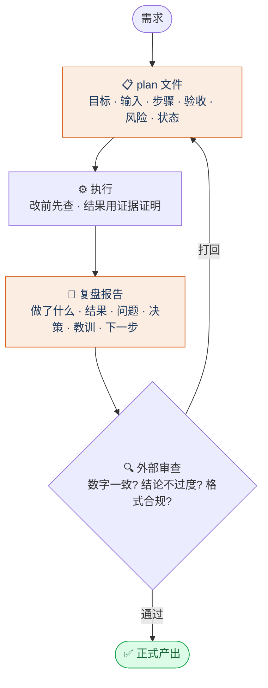

# 体系设计详解 · Architecture Notes

## 1. 为什么是「双角色」而不是一个 Agent

单 Agent 既做规划又做执行时，容易陷入**自我确认偏差**：自己定的方案自己执行、自己验收，错误难以被发现。把角色拆成两个并各自用契约约束，带来三个好处：

- **规划与执行分离** —— 指挥官只管"做什么、做到什么程度"，执行官只管"怎么做"，互为牵制。
- **产出稳定** —— 契约固定了角色边界、命名规范、验证红线，跨任务结果可复现。
- **强制可追溯** —— plan 与复盘把"为什么这么做""结果如何"沉淀成文件，几十个实验也能回溯。

## 2. 角色与契约

| 角色 | 契约 | 核心职责 |
|---|---|---|
| 指挥官 Claude | [`CLAUDE.md`](../CLAUDE.md) | 拆解任务、写 plan、定验收、复核终审 |
| 执行官 Codex | [`AGENTS.md`](../AGENTS.md) | 读 plan、落地执行、写复盘 |
| 外部审查 | 独立 Agent 会话 | 不参与执行，只做逐文件核查 |

> 子目录可放更近的契约文件，作为对该子目录的**更具体约束**，覆盖全局契约。

## 3. 四阶段闭环细节

| 阶段 | 输入 | 输出 | 红线 |
|---|---|---|---|
| plan | 需求 | plan 文件（六项） | 三步以上任务必须先有 plan |
| 执行 | plan | 代码 / 实验 / 文稿 | 改前先查、结果用证据证明 |
| 复盘 | 执行产出 | 复盘报告（六段） | 每个数字可回指产出文件 |
| 外部审查 | 正式产出 | 逐文件核查报告 | 数字一致、结论不过度声明 |

## 4. 防泄漏与诚实协议

这是本体系区别于"随便调 API"的核心纪律：

- **数据划分后不可见的数据不进训练**，只用于事后评估与复盘。
- **基线对照**：每个模型与朴素基线（persistence / naive / 多数类）比较，不脱离基线谈"高精度"。
- **探索性 vs 可写入结论**：冲分 / 调参得到的结果与严格协议下的最终结果分开标注。
- **数据回指**：报告里每个数字都能追到某次运行的产出文件。

## 5. 外部审查机制

正式产出（论文、提交包、平台）前，开一个**独立 Agent 会话**做外部审查。该 Agent 不参与前面的执行，只负责：

1. 逐文件核查正文数字与产出文件是否一致；
2. 检查结论边界是否被夸大（探索性结果是否被写成普适结论）；
3. 检查格式合规与敏感 / 个人信息泄露；
4. 产出一份核查报告，交指挥官终审。
